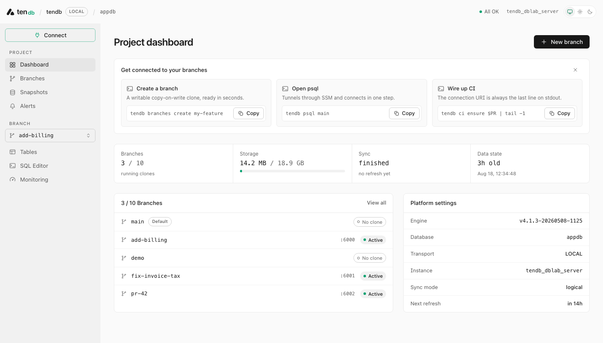

<div align="center">
  <picture>
    <source media="(prefers-color-scheme: dark)" srcset="apps/docs/src/assets/brand/tendb-lockup-dark.png">
    
  </picture>
  <p><strong>The self-hosted Neon alternative — database branching for Postgres, on infrastructure you own.</strong><br>
  Copy-on-write branches of your real database — AWS, GCP, Azure, or your laptop's Docker — ready in seconds.</p>
  <p>
    <a href="https://www.npmjs.com/package/@10play/tendb"></a>
    <a href="https://github.com/10play/tendb/actions/workflows/ci.yml"></a>
    <a href="LICENSE"></a>
  </p>
  <p>
    <a href="https://10play.github.io/tendb/">Documentation</a> ·
    <a href="https://10play.github.io/tendb/getting-started/quickstart/">Quickstart</a> ·
    <a href="apps/example">Example app</a>
  </p>
  <picture>
    <source media="(prefers-color-scheme: dark)" srcset="apps/docs/src/assets/console/dashboard-dark.png">
    
  </picture>
  <p><em>The bundled console (<code>tendb console</code>) — branches, SQL editor, snapshots, and alerts on localhost.</em></p>
</div>

## Try it in five minutes (no cloud account)

Prereqs: Node ≥ 20, Terraform ≥ 1.11, and Docker (macOS: also Homebrew — the
preflight builds a small [colima](https://github.com/abiosoft/colima) VM,
since Docker Desktop's kernel has no ZFS; Linux runs it natively).

```bash
npm install -g @10play/tendb

tendb init --platform local    # scaffold terraform + tendb.json into your project
tendb up                       # ZFS/Docker preflight + terraform apply + config wiring
tendb branches create my-feature   # copy-on-write branch DB, ready in ~5s
tendb psql my-feature              # poke around; production never notices
```

The same flow takes you to production: `tendb init --platform aws` points at
your own cloud account instead — see the
[AWS quickstart](https://10play.github.io/tendb/getting-started/quickstart/),
or the [GCP](https://10play.github.io/tendb/guides/gcp/) and
[Azure](https://10play.github.io/tendb/guides/azure/) platform guides.

## How it works

One host — an EC2 instance, a cloud VM, or Docker containers on your laptop —
runs [DBLab Engine](https://postgres.ai) on ZFS. It syncs from your source
Postgres (Neon, Aurora, RDS, anything with a URL) and serves **copy-on-write
clones**: every branch is a real, writable Postgres that costs only the disk
pages you change and appears in seconds, at any database size.

- **`tendb branches create my-feature`** — a disposable, writable copy of production-shaped data.
- **`tendb ci ensure "$PR" | tail -1`** — a preview database per pull request, one line of CI.
- **`tendb migrate --scratch -- npm run migrate`** — rehearse a migration on an ephemeral branch that cleans up after itself; the real data is untouched.
- **`tendb console`** — a Neon-style dashboard (branches, SQL editor, snapshots, alerts) on localhost.

Your data never leaves your infrastructure: no SaaS, no control plane, no
third party. The CLI reaches the host over each platform's native tunnel
(SSM on AWS, IAP on GCP, Bastion on Azure, loopback locally) — no SSH, no
open database ports.

## Repository

A pnpm monorepo; the product lives in [`packages/tendb/`](packages/tendb/README.md):

| Path | What it is |
|---|---|
| [`packages/tendb/terraform/`](packages/tendb/terraform/) | Per-platform engine/network/console modules behind one [engine contract](packages/tendb/terraform/docs/ENGINE-CONTRACT.md) |
| [`packages/tendb/cli/`](packages/tendb/cli/) | The `@10play/tendb` CLI + bundled web console |
| [`packages/tendb/snapshotd/`](packages/tendb/snapshotd/) | The on-host snapshot/schema executor |
| [`apps/docs/`](apps/docs/) | The documentation site ([live](https://10play.github.io/tendb/)) |
| [`apps/example/`](apps/example/) | A runnable local-platform example: scaffold, branch, migrate, query |

Developing locally: `pnpm install`, then `pnpm docs:dev` for the docs site and
`pnpm --filter @10play/tendb test` for the CLI. See
[`packages/tendb/README.md`](packages/tendb/README.md) for architecture,
sizing, and the CI contract.

## Acknowledgements

tendb is built on [DBLab Engine](https://github.com/postgres-ai/database-lab-engine)
(Database Lab Engine) by [Postgres.ai](https://postgres.ai) — the open-source
engine that does the heavy lifting: ZFS thin cloning and copy-on-write branch
databases. tendb adds the platform packaging around it (Terraform provisioning
for AWS/GCP/Azure/local, tunnel transports, the CLI, the web console, and the
CI contract).

## License

[MIT](LICENSE)
